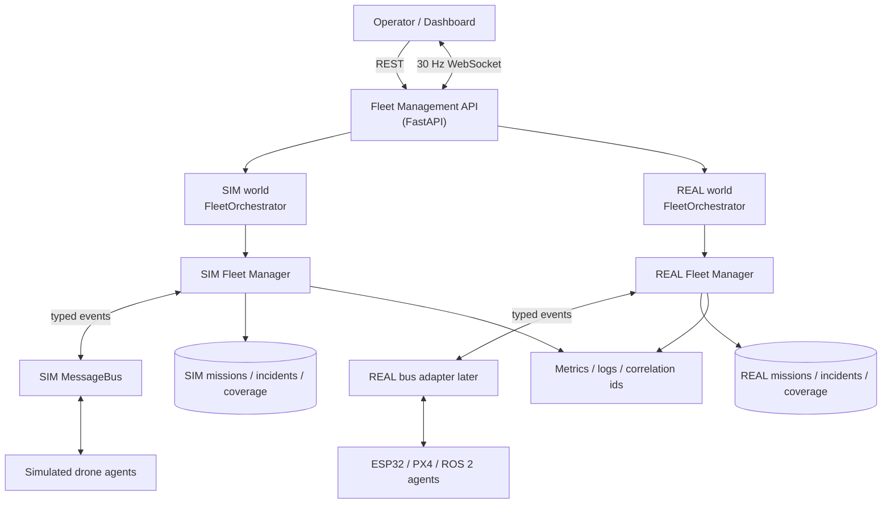

# SentinelSwarm

> Simulation-first, **non-weaponized** autonomous drone **fleet-management** control plane.
> Grew out of a hobby swarm of ESP32-based mini drones I'm building — once I had more than
> one drone, I needed something to actually manage them as a fleet.

SentinelSwarm coordinates a fleet of camera-equipped monitoring drones for perimeter
patrol, facility/infrastructure inspection and situational awareness. Multiple drones
divide patrol zones between themselves, stream telemetry, monitor their own health,
recover from failures, and return to base to recharge — all orchestrated by a typed,
observable control plane.

The control plane now runs two deliberately separate worlds:

- **SIM** — an in-process simulation fleet for rapid iteration, demos and CI.
- **REAL** — an isolated hardware world for future ESP32/PX4/ROS 2 uplinks.

The dashboard switches the whole application between those worlds. A simulated drone's
coverage map, incidents and missions never leak into the real world.

The whole system runs **in simulation** with no physical hardware, but the seams are
deliberately drawn so that **any real drone can plug into the exact same control
plane** as the simulated ones — whether that's my own ESP32 mini-drone builds or a
larger ROS 2 / PX4 vehicle. The drones themselves stay deliberately simple (their build is
tuned for kinetic flight performance, not on-board decision-making) — the actual
intelligence lives in SentinelSwarm.

> ⚠️ **Scope & ethics.** This project is intentionally limited to fleet management.
> It contains **no** weapons, targeting, autonomous engagement, facial recognition or
> person-tracking. Computer-vision hooks are for *environmental/infrastructure* events
> only (e.g. gate open/closed, unexpected object in a restricted zone). See
> [Safety & non-goals](#safety--non-goals).

---

## Table of contents

- [Why this project](#why-this-project)
- [Architecture](#architecture)
- [Tech stack](#tech-stack)
- [The demo scenario](#the-demo-scenario)
- [Quick start](#quick-start)
- [Running the simulation](#running-the-simulation)
- [The dashboard](#the-dashboard)
- [Adding real (or more simulated) drones](#adding-real-or-more-simulated-drones)
- [Testing](#testing)
- [CI/CD](#cicd)
- [Observability](#observability)
- [Repository layout](#repository-layout)
- [Documentation](#documentation)
- [Roadmap](#roadmap)
- [Safety & non-goals](#safety--non-goals)

---

## Why this project

I'm building a small swarm of mini drones on ESP32 hardware as a side project. Their build
is optimised for kinetic flight performance — light, fast, minimal on-board smarts — which
means they can't be relied on to make fleet-level decisions themselves. Pretty quickly it
became obvious that flying more than one drone raises a different set of problems than
flying one: who patrols which zone, what happens when a drone drops off the network
mid-flight, who picks up its job. Rather than push that logic onto constrained hardware, I
wanted one control plane that carries the actual intelligence and that any drone, a
physical ESP32 build or a simulated one, could just plug into. SentinelSwarm is that
control plane, developed simulation-first so the fleet logic can be built and tested
independently of the hardware:

It starts with an explicit, deterministic state machine rather than anything learned —
partly because that's what's needed to reason about safety first, but also because a
clean state machine is the easiest possible foundation to build on. Once the rules for
when a drone can take off, patrol, fail or come home are nailed down and testable,
swapping a rule ("pick the closest available drone") for a learned policy later is a
localised change, not a rewrite.

| Capability | Where it lives |
| --- | --- |
| Autonomous mission scheduling | [`fleet/scheduler.py`](src/sentinelswarm/fleet/scheduler.py) |
| Multi-robot coordination & fleet state | [`fleet/manager.py`](src/sentinelswarm/fleet/manager.py), [`fleet/state.py`](src/sentinelswarm/fleet/state.py) |
| Explicit, validated drone state machine | [`domain/states.py`](src/sentinelswarm/domain/states.py) |
| Distributed messaging (subjects, wildcards, acks) | [`messaging/`](src/sentinelswarm/messaging) |
| Health monitoring & comms-loss detection | [`fleet/manager.py`](src/sentinelswarm/fleet/manager.py) |
| Failure handling & mission reassignment | [`fleet/manager.py`](src/sentinelswarm/fleet/manager.py) |
| Battery-aware scheduling & return-to-base | [`fleet/scheduler.py`](src/sentinelswarm/fleet/scheduler.py), [`agents/base.py`](src/sentinelswarm/agents/base.py) |
| Edge/vehicle agents + sim/real driver seam | [`agents/`](src/sentinelswarm/agents) |
| Isolated SIM/REAL worlds | [`api/app.py`](src/sentinelswarm/api/app.py) |
| 30 Hz telemetry streaming | [`agents/base.py`](src/sentinelswarm/agents/base.py), [`api/app.py`](src/sentinelswarm/api/app.py) |
| Zoomable 2D map + interactive 3D reconstruction | [`api/static/app.js`](src/sentinelswarm/api/static/app.js), [`api/static/app.css`](src/sentinelswarm/api/static/app.css) |
| Observability (logs, metrics, correlation ids) | [`observability/`](src/sentinelswarm/observability) |
| Typed control-plane API + dashboard | [`api/`](src/sentinelswarm/api) |
| Deterministic end-to-end simulation | [`sim/`](src/sentinelswarm/sim) |

Design principles: **explicit state machines**, **typed interfaces**, **deterministic
control**, **event-driven communication**, and **safe failure modes** — with no
unnecessary microservices, Kubernetes, or fake AI. The state machine and scheduler are
deliberately plain today so they stay a solid, well-tested base to extend later — e.g.
swapping the scheduler's matching rule for a learned policy without touching anything
else.

---

## Architecture



**Data flow.** Drone agents publish `uplink.telemetry.<id>` and `uplink.event.<id>`
(registration, heartbeats, mission lifecycle, faults). Each world has its own manager,
message bus and state store. The dashboard subscribes to `/ws/sim` or `/ws/real` and keeps
map coverage isolated per world.

See [docs/ARCHITECTURE.md](docs/ARCHITECTURE.md) for component responsibilities, the event
model, and the API model.

---

## Tech stack

| Concern | Choice | Rationale |
| --- | --- | --- |
| Language | **Python 3.11+** | Matches ROS 2 `rclpy`, OpenCV, fast iteration, strong typing |
| API | **FastAPI + Uvicorn + Pydantic v2** | Typed, async, auto OpenAPI docs |
| Messaging | **Subject-based bus** (in-memory; NATS/MQTT-ready) | Runs with zero infra; clean seam to a real broker |
| Live stream | **WebSocket at 30 Hz** | Smooth operator picture without REST polling |
| Simulation | **Custom kinematic + battery model** | Deterministic, dependency-free, CI-friendly; PX4/Gazebo behind the driver seam |
| Dashboard | **Buildless ESM + Canvas + Three.js** | Multi-page command SPA, pan/zoom 2D map and interactive 3D terrain without a Node build |
| UI assets | Vendored Three.js, OrbitControls, Space Grotesk, IBM Plex Mono | Self-contained runtime assets packaged in the wheel |
| Persistence | In-memory repositories (PostgreSQL-ready interface) | Simulation-first & deterministic tests |
| Observability | **Prometheus** metrics, structured **JSON logs**, correlation ids | Production-style telemetry |
| Testing | **pytest + pytest-asyncio**, deterministic virtual clock | Reproducible unit + e2e tests |
| Tooling | **ruff** (lint+format), **mypy --strict** | Enforced in CI |
| Packaging | Docker (multi-stage) + docker-compose | One-command local stack |

Technologies are included **only where justified** — e.g. no Kubernetes, no message broker
dependency for the core demo. ROS 2 / PX4 / Gazebo and NATS/MQTT are documented extension
points rather than bolted on.

---

## The demo scenario

Three simulated drones patrol three zones. Mid-patrol, one drone suffers a **silent comms
loss**. The fleet detects the missing heartbeats, marks the drone offline, raises an
incident, and **reassigns its mission** to a healthy drone. All missions complete and the
surviving drones return to base.

Running `sentinelswarm-sim` produces a deterministic timeline (accelerated virtual time):

```text
=== t=   3.0s  [launch + transit] ===
  fleet: size=3 healthy=3 offline=0 active_missions=3 pending=0 incidents=0
    sim-1   state=TRANSIT     battery= 99.7%  health=HEALTHY
    sim-2   state=TRANSIT     battery= 99.7%  health=HEALTHY
    sim-3   state=TRANSIT     battery= 99.7%  health=HEALTHY

>>> injecting COMMS LOSS on sim-2 <<<

=== t=  15.0s  [failure detected + reassignment] ===
  fleet: size=3 healthy=2 offline=1 active_missions=2 pending=1 incidents=1
    sim-1   state=PATROLLING  battery= 97.1%  health=HEALTHY
    sim-2   state=OFFLINE     battery= 98.7%  health=UNHEALTHY
    sim-3   state=PATROLLING  battery= 97.1%  health=HEALTHY

=== t=  75.0s  [final] ===
  fleet: size=3 healthy=2 offline=1 active_missions=0 pending=0 incidents=1
  mission_success_rate=1.0
    sim-1   state=IDLE        battery= 99.9%  health=HEALTHY
    sim-2   state=OFFLINE     battery= 98.7%  health=UNHEALTHY
    sim-3   state=IDLE        battery= 99.6%  health=HEALTHY

--- missions ---
  mission-…  PATROL_ZONE  COMPLETED  drone=sim-1  attempts=1
  mission-…  PATROL_ZONE  COMPLETED  drone=sim-1  attempts=2   ← reassigned from sim-2
  mission-…  PATROL_ZONE  COMPLETED  drone=sim-3  attempts=1
--- incidents ---
  inc-…  COMMS_LOSS  drone=sim-2  :: no heartbeat for 6.0s
```

The exact same setup is asserted automatically in
[tests/test_e2e_simulation.py](tests/test_e2e_simulation.py).

---

## Quick start

Requires Python 3.11+ (3.12 recommended).

```powershell
# 1. create a virtual environment
python -m venv .venv
.\.venv\Scripts\Activate.ps1        # Windows
# source .venv/bin/activate         # macOS/Linux

# 2. install with dev + vision extras
pip install -e ".[dev,vision]"

# 3. run the accelerated demo
sentinelswarm-sim

# 4. run the tests
pytest
```

---

## Running the simulation

```bash
sentinelswarm-sim                 # 3 drones, fail sim-2 via comms loss
sentinelswarm-sim --drones 5      # scale the fleet
sentinelswarm-sim --fail-drone sim-3
sentinelswarm-sim --json-logs     # structured JSON logging
```

The demo runs in **deterministic virtual time** (`ManualClock`), so it completes in well
under a second while simulating ~75 seconds of fleet activity.

---

## The dashboard

Start the live control plane (real-time simulation, seeds 3 drones):

```bash
uvicorn sentinelswarm.api.app:app --reload
```

Then open:

- **Dashboard:** http://localhost:8000/dashboard — a multi-page command console with
  Overview, Tactical Map, 3D Terrain, Units, Missions and Incidents pages.
- **SIM / REAL switch:** the large top-left switch changes the entire application context.
  SIM and REAL have separate mission queues, incidents, map coverage and live streams.
- **Tactical Map:** wheel zoom, drag pan, infinite sparse coverage grid, mapped area in
  `m²`, range rings, patrol zones, trails and altitude-aware drone markers.
- **3D Terrain:** interactive Three.js reconstruction of the current world's coverage map.
  Drag to orbit, wheel to zoom, right-drag to pan.
- **API docs (OpenAPI):** http://localhost:8000/docs
- **Metrics:** http://localhost:8000/metrics

World-specific endpoints are namespaced:

```bash
curl localhost:8000/api/worlds
curl localhost:8000/api/sim/fleet
curl localhost:8000/api/real/fleet
curl -X POST localhost:8000/api/sim/missions \
  -H 'content-type: application/json' \
  -d '{"type":"PATROL_ZONE","x":120,"y":0,"radius":20}'
curl -X POST localhost:8000/api/sim/drones/sim-2/fault \
  -H 'content-type: application/json' -d '{"code":"comms_loss"}'
```

Live streams are `ws://localhost:8000/ws/sim` and `ws://localhost:8000/ws/real`.

Or bring up the full stack (API + Prometheus + Grafana) with Docker:

```bash
docker compose up --build
# dashboard  -> http://localhost:8000/dashboard
# prometheus -> http://localhost:9090
# grafana    -> http://localhost:3000  (anonymous access enabled)
```

---

## Adding real (or more simulated) drones

The fleet is designed to scale seamlessly between simulated and real vehicles, and to not
care which kind of hardware is behind a drone. A drone is just a `DroneDriver` behind a
`DroneAgent`, so an ESP32 mini-drone talking over Wi-Fi/MQTT and a ROS 2/PX4 vehicle plug
in exactly the same way:

```python
# simulated — add/remove at runtime
orchestrator.add_simulated_drone("sim-4")
orchestrator.remove_drone("sim-2")

# real — implement DroneDriver for the vehicle's own link (ESP32 firmware, MAVSDK/PX4, ...)
from sentinelswarm.agents.ros2_px4 import Ros2Px4Driver
orchestrator.add_drone(Ros2Px4Driver("uav-01", connection_url="udp://:14540"))
```

`Ros2Px4Driver` is a documented stub ([agents/ros2_px4.py](src/sentinelswarm/agents/ros2_px4.py))
showing exactly which methods a real integration implements — the control plane needs **no**
changes regardless of what's on the other end of that interface. Over the API,
`POST /api/sim/drones` adds a simulated drone to the SIM world and
`DELETE /api/sim/drones/{id}` retires one. REAL hardware will attach under the REAL world
without inheriting SIM missions, coverage or incidents.

---

## Testing

```bash
pytest                      # full suite (unit + integration + e2e)
pytest tests/test_e2e_simulation.py
ruff check . && ruff format --check .
mypy
```

Coverage of meaningful behaviours:

- **State machine** — valid/invalid transitions ([test_state_machine.py](tests/test_state_machine.py))
- **Scheduler** — closest/priority/battery-feasibility/determinism ([test_scheduler.py](tests/test_scheduler.py))
- **Reassignment** — mission recovers after a drone dies ([test_reassignment.py](tests/test_reassignment.py))
- **Lost heartbeat** — comms-loss detection ([test_heartbeat.py](tests/test_heartbeat.py))
- **Battery threshold** — emergency return-to-base ([test_battery.py](tests/test_battery.py))
- **Idempotency / ordering** — duplicate & non-owner events ignored ([test_idempotency.py](tests/test_idempotency.py))
- **Messaging** — subject routing, wildcards, isolation ([test_bus.py](tests/test_bus.py))
- **API** — validation (422), 404s, CRUD, metrics ([test_api.py](tests/test_api.py))
- **World separation** — SIM missions/state remain invisible to REAL ([test_api.py](tests/test_api.py))
- **End-to-end** — the full documented scenario ([test_e2e_simulation.py](tests/test_e2e_simulation.py))

---

## CI/CD

[GitHub Actions](.github/workflows/ci.yml) runs on every push/PR:

1. **Lint** — `ruff check` + `ruff format --check`
2. **Type-check** — `mypy --strict`
3. **Test** — `pytest` on Python 3.11 and 3.12
4. **Build** — wheel + sdist artifacts
5. **Container** — `docker build` + a `/health` smoke test

CI never deploys to real hardware.

---

## Observability

- **Metrics** (`/metrics`, Prometheus): fleet size, drones-by-state, healthy/offline counts,
  active missions, mission success rate & latency histogram, message latency, battery per
  drone, incidents, heartbeats, reassignments.
- **Logs**: structured JSON with a `correlation_id` propagated per mission/event.
- **Traces**: correlation ids thread a mission across creation → assignment → telemetry →
  failure → reassignment. OpenTelemetry is a documented extension point.

Details in [docs/OBSERVABILITY.md](docs/OBSERVABILITY.md).

---

## Repository layout

```
src/sentinelswarm/
  domain/         pure entities & rules (geometry, states, drone, mission, clock)
  messaging/      typed events, subjects, bus abstraction + in-memory impl
  agents/         drone-side agent + drivers (simulated + ros2/px4 seam)
  fleet/          manager, scheduler, incidents, in-memory state store
  observability/  structured logging + Prometheus metrics
  api/            FastAPI app, schemas, packaged dashboard (static/)
  api/static/     buildless command SPA, CSS, JS, vendored Three.js/fonts
  sim/            orchestrator, demo scenario, CLI runner
tests/            unit, integration and end-to-end tests
docs/             architecture & design documentation
deploy/           prometheus + grafana provisioning
```

---

## Documentation

- [docs/ARCHITECTURE.md](docs/ARCHITECTURE.md) — components, tech decisions, event & API models
- [docs/FLEET_STATE_MACHINE.md](docs/FLEET_STATE_MACHINE.md) — states & transition table
- [docs/FAILURE_HANDLING.md](docs/FAILURE_HANDLING.md) — failure modes, detection, response
- [docs/NETWORKING.md](docs/NETWORKING.md) — heartbeats, retries, idempotency, ordering
- [docs/OBSERVABILITY.md](docs/OBSERVABILITY.md) — logs, metrics, traces
- [docs/DEMO.md](docs/DEMO.md) — running the demo & what to look for
- [docs/ANTIGRAVITY_SUMMARY.md](docs/ANTIGRAVITY_SUMMARY.md) — short continuation summary for Antigravity
- [docs/HANDOVER.md](docs/HANDOVER.md) — current state and next steps for continuing in another tool
- [CONTRIBUTING.md](CONTRIBUTING.md) — dev setup & conventions

---

## Roadmap

- [ ] `Ros2Px4Driver` backed by PX4 SITL + Gazebo (behind the existing seam)
- [ ] ESP32 hardware uplink driver (Wi-Fi/MQTT or serial bridge) for the REAL world
- [ ] NATS/MQTT bus adapter (drop-in for `InMemoryBus`)
- [ ] PostgreSQL-backed fleet/mission/incident repositories
- [ ] OpenTelemetry traces + Grafana dashboards committed to `deploy/`
- [ ] OpenCV environmental-event detectors (gate open/closed, object-in-zone) emitting `VisionEvent`s
- [ ] Smarter scheduler (workload balancing, charge-aware routing) behind the current deterministic one
- [ ] Learned/adaptive scheduling policy as a drop-in for `FleetScheduler.plan()`, once the deterministic version has enough real flight data to validate against

---

## Safety & non-goals

SentinelSwarm is a **monitoring / situational-awareness** system. It explicitly does **not**
implement, and will not accept contributions implementing:

- weapons, targeting, or autonomous engagement of any kind
- facial recognition or identification/tracking of specific persons
- offensive or military functionality
- unbounded autonomous behaviour (missions are bounded, validated and recoverable)

Computer-vision features are limited to **equipment and infrastructure** awareness
(e.g. detecting that a gate changed state or an unexpected object appeared in a restricted
zone) using simulated/test imagery.

## License

[MIT](LICENSE)
