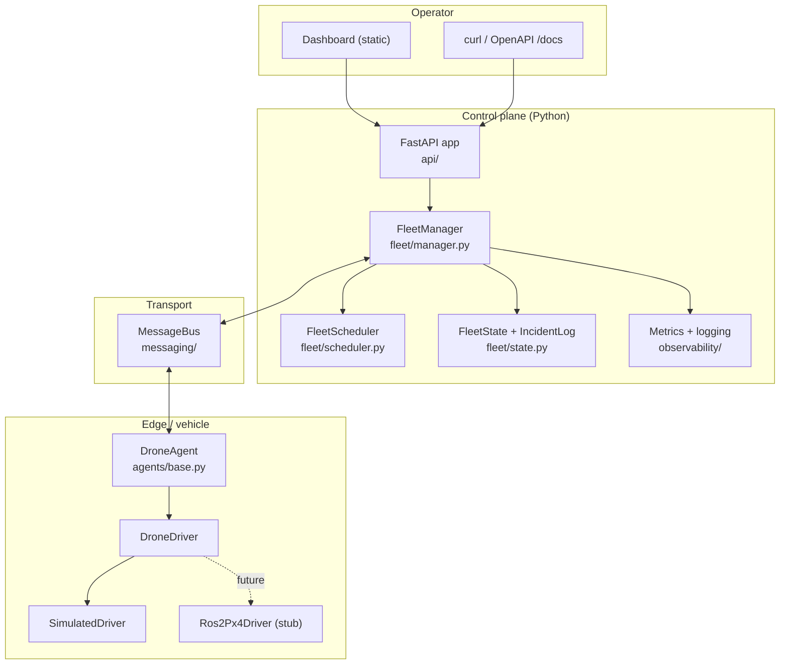

# Architecture

This document describes the architecture of SentinelSwarm: component
responsibilities, technology decisions, the event model and the API model.

## 1. Goals & constraints

- **Simulation-first**: everything runs without hardware and in CI.
- **Real-drone-ready**: simulated and real vehicles share one control plane.
- **Thin edge, smart control plane**: the vehicles themselves are kept minimal (they report
  telemetry and follow setpoints); fleet-level decisions live entirely in SentinelSwarm.
- **Deterministic**: control logic is reproducible (virtual clock, pure scheduler).
- **Observable**: metrics, structured logs and correlation ids from day one.
- **Safe**: non-weaponized, bounded autonomy, validated state transitions.

## 2. Layered design

## 3. Component responsibilities

| Component | File(s) | Responsibility |
| --- | --- | --- |
| **Domain** | `domain/` | Pure entities & rules: `Position`/`Zone` geometry, `DroneState` machine, `Mission` + `RetryPolicy`, `Drone` twin, `Clock` abstraction. No framework deps. |
| **Messaging** | `messaging/` | Typed `Event` model, subject helpers, `MessageBus` protocol + `InMemoryBus` (routing, wildcards, fan-out, isolation, drain). |
| **Agents** | `agents/` | `DroneAgent` runs mission execution + the vehicle-side state machine; `DroneDriver` is the sim/real seam; `SimulatedDriver` integrates kinematics + battery. |
| **Fleet** | `fleet/` | `FleetManager` ingests telemetry, monitors health, schedules, handles failures & reassignment; `FleetScheduler` is a pure matcher; `FleetState` is the in-memory store; `IncidentLog` is the audit trail. |
| **Observability** | `observability/` | Structured JSON logging with correlation ids; Prometheus metrics with an injectable registry. |
| **API** | `api/` | FastAPI routes, Pydantic schemas, packaged dashboard. |
| **Sim** | `sim/` | `FleetOrchestrator` wires everything and supports runtime add/remove of drones; demo scenario; CLI runner with deterministic virtual time. |

## 4. Technology decisions

- **Python 3.11+** for the whole control plane — matches ROS 2 `rclpy` and OpenCV, and
  keeps the codebase in one language. C++ is reserved for future performance-critical ROS 2
  nodes (documented, not built).
- **FastAPI + Pydantic v2** — typed request/response models, async, free OpenAPI docs.
- **In-memory subject bus** instead of a broker dependency — the demo runs with zero infra,
  yet `MessageBus` mirrors NATS semantics (subjects + `*`/`>` wildcards, at-least-once
  handler execution), so a NATS/MQTT adapter is a drop-in.
- **Custom kinematic simulator** instead of Gazebo/PX4 for the core — deterministic and
  CI-friendly. PX4 SITL + Gazebo sit behind the `DroneDriver` seam.
- **In-memory repositories** with a small interface — deterministic tests today,
  PostgreSQL later without touching `FleetManager`.
- **Deterministic `ManualClock`** — makes the async control loops reproducible in tests and
  lets the demo run far faster than real time.

We deliberately avoid Kubernetes, unnecessary microservices, and any "AI" that isn't real.

## 5. Event model

Envelope fields on every `Event` (`messaging/events.py`): `type`, `event_id`, `source`,
`correlation_id`, `ts`, `seq`. These enable idempotency (`event_id`), ordering/gap
detection (`seq`), and tracing (`correlation_id`).

Subjects (`messaging/topics.py`):

| Subject | Direction | Payloads |
| --- | --- | --- |
| `uplink.telemetry.<drone_id>` | drone → control | `Telemetry` (pose, battery, state) |
| `uplink.event.<drone_id>` | drone → control | `DroneRegistered`, `Heartbeat`, `MissionAccepted/Progress/Completed/Failed`, `FaultDetected`, `VisionEvent` |
| `command.<drone_id>` | control → drone | `AssignMission`, `AbortMission`, `ReturnToBase`, `Ping` |
| `fleet.event` | control → operators | `MissionCreated/Assigned/Reassigned`, `IncidentCreated`, `DroneOffline` |

The manager subscribes with wildcards (`uplink.telemetry.>`, `uplink.event.>`); each drone
subscribes to its own `command.<id>`.

## 6. API model

Base URL `/`. Full schema at `/docs` (OpenAPI). Summary:

| Method & path | Purpose |
| --- | --- |
| `GET /health` | Liveness |
| `GET /metrics` | Prometheus metrics |
| `GET /api/fleet` | Fleet summary (counts, success rate, battery, incidents) |
| `GET /api/drones` · `GET /api/drones/{id}` | List / get drone twins |
| `POST /api/drones` · `DELETE /api/drones/{id}` | Add / retire a simulated drone at runtime |
| `POST /api/drones/{id}/fault` | Inject a fault (demo) |
| `GET /api/missions` · `GET /api/missions/{id}` | List / get missions |
| `POST /api/missions` | Create a mission (patrol/inspection) |
| `POST /api/missions/{id}/cancel` | Cancel a mission |
| `GET /api/incidents` | Incident audit trail |
| `GET /dashboard` | Operator dashboard (static) |

## 7. Extension points (the seams that matter)

- **Real drones**: implement `DroneDriver` (see `agents/ros2_px4.py`) → register via
  `orchestrator.add_drone(driver)`.
- **Real broker**: implement `MessageBus` over NATS/MQTT → inject into `FleetOrchestrator`.
- **Persistence**: back `FleetState`/`IncidentLog` with PostgreSQL.
- **Smarter scheduling**: replace `FleetScheduler.plan()` (pure function) with an optimiser.
