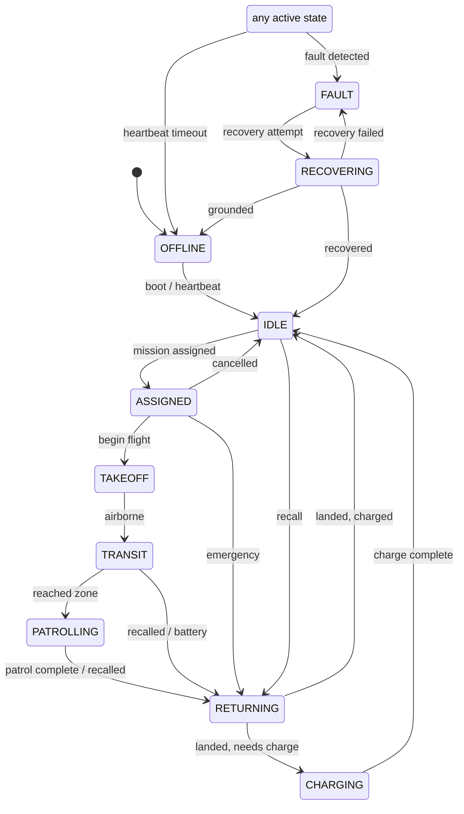

# Fleet state machine

Every drone twin in the control plane and the vehicle-side agent share one explicit,
**validated** state machine. The transition table in
[`domain/states.py`](../src/sentinelswarm/domain/states.py) is the single source of truth;
illegal transitions raise `InvalidStateTransition` (control-plane initiated) or are logged
as bugs (vehicle side), never silently applied.

## States

| State | Meaning |
| --- | --- |
| `OFFLINE` | Not communicating (boot, or comms lost). |
| `IDLE` | Online, healthy, available for tasking. |
| `ASSIGNED` | A mission has been accepted but flight has not begun. |
| `TAKEOFF` | Climbing to cruise altitude. |
| `TRANSIT` | En route to the mission target/zone. |
| `PATROLLING` | Loitering / inspecting within the target zone. |
| `RETURNING` | Flying back to base (mission done, recalled, battery, or emergency). |
| `CHARGING` | On the pad, recharging before returning to service. |
| `FAULT` | A fault was detected; the vehicle holds. |
| `RECOVERING` | Attempting recovery from a fault before re-entering service. |

## Transition diagram

> `FAULT` is reachable from every operational state, and `OFFLINE` from every state where a
> heartbeat could be lost. Those edges are generated in `states._build_transition_table()`
> so the table stays consistent.

## Validation rules

- `can_transition(src, dst)` returns `True` for `src == dst` (idempotent updates) and for
  any edge present in the table.
- `Drone.transition(dst, now)` **raises** `InvalidStateTransition` on an illegal edge —
  used for control-plane-initiated changes (e.g. marking `OFFLINE`).
- On the **vehicle** side, telemetry can skip intermediate states after message loss, so the
  agent/twin trust the vehicle as ground truth but log any illegal edge as a bug
  (`FleetManager._apply_reported_state`).

## Who drives transitions

| Transition source | Mechanism |
| --- | --- |
| Vehicle progress (takeoff → transit → patrol → return) | `DroneAgent._advance()` each tick |
| Mission assignment | `command.<id>` → `DroneAgent._accept_mission()` |
| Battery emergency | `DroneAgent._maybe_emergency_return()` |
| Fault | `DroneAgent._handle_fault()` |
| Comms-loss → `OFFLINE` | `FleetManager._check_health()` (heartbeat timeout) |
| Twin mirroring | `FleetManager._apply_reported_state()` from telemetry |

Tested in [tests/test_state_machine.py](../tests/test_state_machine.py).
